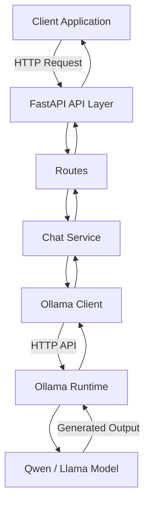
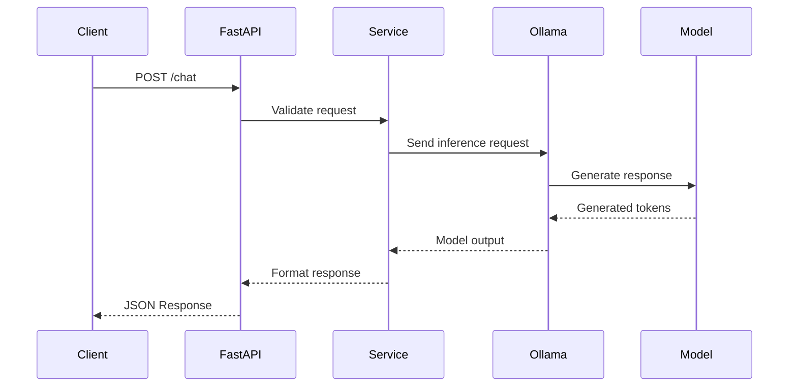

# LLM Serving API with FastAPI & Ollama


A production-oriented educational implementation of an **LLM serving backend** built using **FastAPI and Ollama**.

This project focuses on understanding the engineering principles behind modern LLM inference systems rather than only calling an LLM API.

The goal is to build a lightweight version of an inference server that handles:

- API request validation
- Model abstraction
- Async communication with inference engines
- Error handling
- Health monitoring
- Model discovery
- Future scaling concepts like streaming, batching, and rate limiting

---

# 🎯 Motivation

A client application should not directly interact with the model runtime.

The client does not need to know:

- Which model is running
- Where the model is hosted
- How inference is performed
- How failures are handled internally

The backend provides an abstraction layer.

```
Client
  |
  |  "Generate response"
  |
  v
LLM Serving API
  |
  |  Validate request
  |  Select model
  |  Handle errors
  |
  v
Ollama Runtime
  |
  v
LLM Model
```

This architecture is similar to how production LLM APIs expose models as services.

---

# 🏗️ Architecture



---

# 🔄 Request Lifecycle



---

# ✨ Features

## Phase 1: Core LLM Serving Backend ✅

### API Layer

- FastAPI based backend
- Async endpoint handling
- Pydantic request validation
- Swagger API documentation


### LLM Integration

- Ollama runtime integration
- Custom async HTTP client
- Model inference abstraction
- Separation between API and model layer


### Configuration Management

- Environment based configuration
- `.env` support
- Centralized application settings


### Reliability

- Custom application exceptions
- Global exception handling
- Consistent API error responses


### Observability

- Structured logging
- Daily log files
- Health monitoring endpoint


### Model Management

- Dynamic model discovery
- Fetch available models from Ollama runtime

---

# 📂 Project Structure

```
llm-serving/

├── app/
│
├── clients/
│   ├── http.py              # Async HTTP client wrapper
│   └── ollama.py            # Ollama API communication
│
├── core/
│   ├── config.py            # Application configuration
│   ├── exceptions.py        # Custom exceptions
│   ├── logger.py            # Logging setup
│   └── models.py            # Internal model definitions
│
├── routes/
│   ├── chat.py              # Chat completion endpoint
│   ├── health.py            # Health check endpoints
│   └── models.py            # Model listing endpoint
│
├── schemas/
│   └── chat.py              # Request/response schemas
│
├── services/
│   └── chat.py              # Business logic layer
│
├── main.py                  # FastAPI application entry point
│
├── .env                     # Environment variables
├── pyproject.toml           # Dependency management
├── uv.lock                  # Locked dependencies
└── README.md
```

---

# ⚙️ Setup

This project uses **uv** for dependency management.

## Install uv

```bash
pip install uv
```

---

## Install dependencies

```bash
uv sync
```

---

# 🤖 Setup Ollama

Install Ollama from:

https://ollama.com/


Check installation:

```bash
ollama --version
```

---

## Start Ollama server

```bash
ollama serve
```

Ollama runs by default at:

```
http://127.0.0.1:11434
```

---

## Download Model

Example:

```bash
ollama pull qwen:0.5b
```

Verify:

```bash
ollama list
```

Expected:

```
NAME
qwen:0.5b
```

---

# 🚀 Running the API

Start FastAPI server:

```bash
uv run uvicorn app.main:app --reload
```

Server:

```
http://127.0.0.1:8000
```

Swagger documentation:

```
http://127.0.0.1:8000/docs
```

---

# 🔌 API Documentation

## Health Check

### Endpoint

```
GET /health
```

Purpose:

- Check API availability
- Verify Ollama connectivity


Example Response:

```json
{
    "status": "healthy",
    "checks": {
        "api": "healthy",
        "ollama": "healthy"
    }
}
```

---

# Available Models

### Endpoint

```
GET /models
```

Returns models available in Ollama runtime.

Example:

```json
{
    "models": [
        "qwen:0.5b"
    ]
}
```

---

# Chat Completion

### Endpoint

```
POST /chat
```

Request:

```json
{
    "model": "qwen:0.5b",
    "messages": [
        {
            "role": "user",
            "content": "Explain transformers"
        }
    ],
    "stream": false
}
```

Response:

```json
{
    "model": "qwen:0.5b",
    "response": "Transformers are neural network architectures..."
}
```

---

# 🧠 Design Decisions

## Why separate Client and Service layer?

Instead of:

```
Route
 |
 |---- Ollama API call
```

The project follows:

```
Route
 |
Service
 |
Client
 |
External API
```

Benefits:

- Easier testing
- Cleaner responsibilities
- Easier replacement of inference engines


Example:

Today:

```
FastAPI → Ollama
```

Future:

```
FastAPI → vLLM
FastAPI → TGI
FastAPI → Custom inference server
```

Only the client layer changes.

---

# 🛣️ Roadmap

## Phase 2: Production API Features

- [ ] Token streaming using `StreamingResponse`
- [ ] Request ID middleware
- [ ] Improved request logging
- [ ] Retry mechanism
- [ ] Timeout handling
- [ ] API authentication


## Phase 3: Scaling LLM Serving

- [ ] Rate limiting
- [ ] Request queue
- [ ] Concurrent inference handling
- [ ] Dynamic batching
- [ ] Prometheus metrics
- [ ] Docker deployment


## Phase 4: Advanced Inference

- [ ] Multiple model support
- [ ] Model routing
- [ ] Token usage tracking
- [ ] GPU monitoring
- [ ] Kubernetes deployment
- [ ] Distributed inference


---

# 📚 Learning Outcomes

Through this project, I am exploring:

## Backend Engineering

- Designing scalable APIs
- Async programming
- Dependency management
- Error handling patterns
- Service architecture


## LLM Infrastructure

- Model serving architecture
- Inference request lifecycle
- Model abstraction
- Latency considerations
- Streaming generation


## Production Concepts

- Health checks
- Configuration management
- Logging
- Monitoring
- Reliability patterns


---

# Future Vision

The long-term goal of this project is to evolve this educational implementation into a lightweight LLM inference platform supporting:

- Multiple models
- Streaming generation
- Request scheduling
- Batching
- Monitoring
- Production deployment patterns

The project aims to bridge the gap between **using LLM APIs** and **understanding how LLM serving infrastructure is built**.